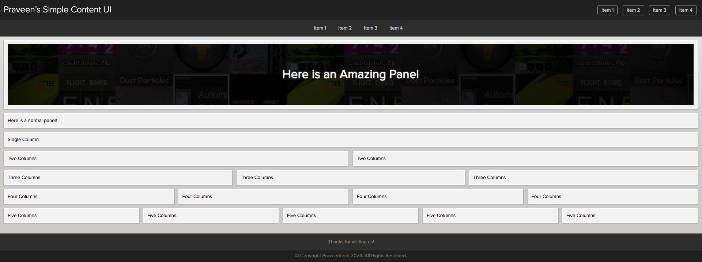
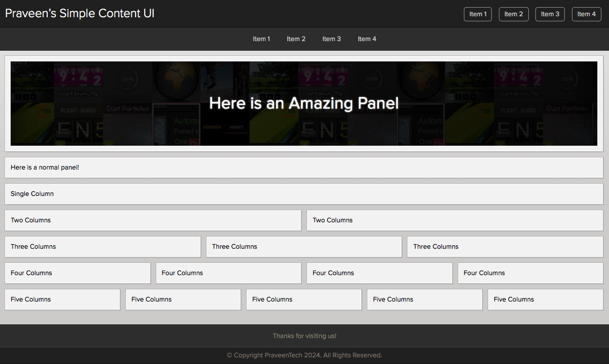
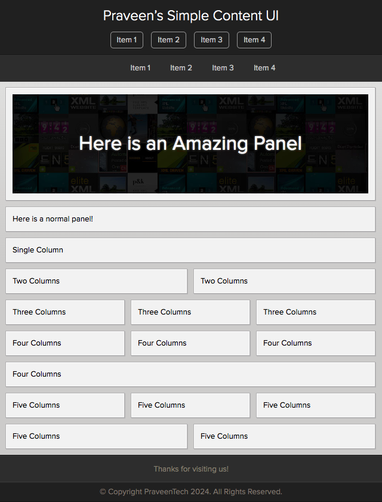
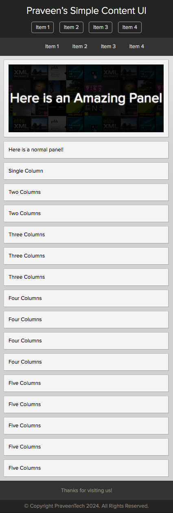

# ThemeForest Style Theme 2020

Hey everyone, as most of you know, I’m [Praveen Kumar](https://praveen.science) and I’m super fascinated by all the amazing designs.

ThemeForest is an amazing website that hosts a lot of designs, but before that, their own design looks amazing in 2020s.

I thought of rebuilding the same kind of theme from scratch for an Open Source Experience, hence we got this!

Feel free to contribute.

## Features

Features of this Theme and repository:

* Fonts are Data URI, so you don’t need to host on them.
* Open Source versions of some Premium Fonts included.
* Responsive Design using FlexBox.
* Won’t say a Rip off, but it kinda is!

### Screenshots

On Full HD 1920px Screens

On HD 1200px Screens

On Smaller 640px Screens

On Smaller 425px Mobile Screens

## Usage

This is powering the below sites:

* [United Kingdom (UK) Tamil Makkal Forum](https://uktamilmakkalforum.prav.win/)

## Contributing

Feel free to raise an Issue and a Pull Request if you want to discuss something or if you’re ready.
